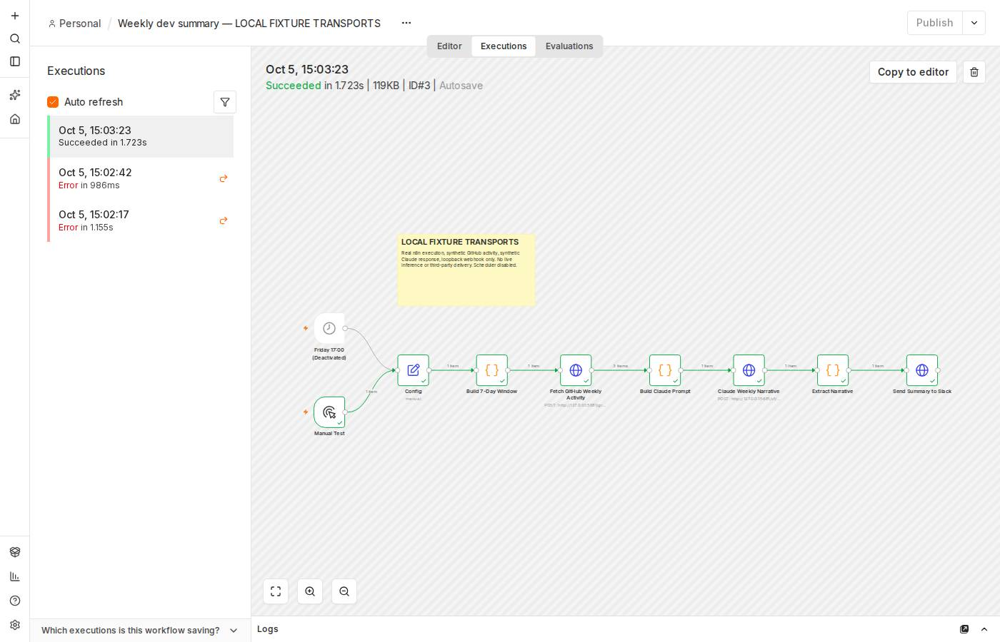

# Weekly GitHub Dev Summary — n8n + Claude

An importable workflow for issue #5: collect seven days of default-branch commits, closed issues, and merged pull requests; ask Claude for an English or French narrative; deliver it to a Slack incoming webhook. The export is **inactive** and includes a Manual Test trigger and an optional Friday 17:00 schedule (`America/New_York`).

## Setup — 4 steps

1. **Import** `weekly-dev-summary.json` into n8n. The local verification below used n8n 2.41.7.
2. **Configure** the `Config` node: `githubRepo` (`owner/repo`), `slackWebhookUrl`, `language` (`EN` or `FR`), and an available `claudeModel` (default `claude-sonnet-5`).
3. **Provide secrets** to your trusted, self-hosted n8n process as `GITHUB_TOKEN` and `ANTHROPIC_API_KEY`. n8n 2.x blocks `$env` access by default: explicitly permit it with `N8N_BLOCK_ENV_ACCESS_IN_NODE=false` for this trusted deployment, then restart. The GitHub token needs read access to the selected repository. These values are never embedded in this export.
4. **Run `Manual Test`**, inspect all node outputs, confirm the intended Slack destination received the message, and save the live execution screenshot. Leave the workflow inactive during setup; enable its Friday schedule only if you choose to run it automatically.

## Collection and failure behavior

The GitHub GraphQL request pages each activity connection independently in batches of 100, skipping completed connections. Issues and PRs use `closed:` and `merged:` searches bounded by the same seven-day window as commit history. The prompt deduplicates records, enforces both time boundaries, includes exact counts, and makes empty categories explicit. Activity is a snapshot; GitHub's search indexing may lag recent updates.

The workflow stops before generation or delivery on GraphQL errors, an inaccessible repository, incomplete pagination after 100 requests, or an issue/PR search exceeding GitHub's 1,000-result limit. A busy repository that exceeds those bounds needs a narrower reporting interval or a different collection strategy. It also rejects empty or token-truncated Claude responses. Text blocks and Markdown lists use real newlines.

The final HTTP node posts `{"text": "..."}` to the configured Slack incoming webhook. It fails on an HTTP error. The workflow does not retry an entire delivery automatically, so inspect failed executions before manually rerunning to avoid duplicate messages.

## Model availability

Issue #5 requested `claude-sonnet-4-20250514`. Anthropic's [model deprecation documentation](https://platform.claude.com/docs/en/about-claude/model-deprecations) lists its retirement as June 15, 2026. The configurable default is now `claude-sonnet-5`; select a model available to your Anthropic account. No live Anthropic inference has been performed for the evidence below.

## Reproducible local verification

`node --test bounty-5/weekly-dev-summary.test.mjs` checks configuration, time boundaries, deduplication, pagination state, incomplete/error responses, French prompts, real newlines, and empty/truncated model output.

`python bounty-5/verify-local.py /tmp/cbb5-evidence` starts **loopback-only HTTP fixtures** and writes `verification-workflow.json`. Import that variant into a local n8n instance and manually execute it while the fixture server runs in the same network namespace. It disables the schedule and replaces only repository configuration, provider URLs, and authorization headers with explicitly fake transport values. The production code and pagination expressions remain unchanged.

The fixture supplies 135 commits, 205 closed issues, and one merged PR over three GitHub pages, returns two labeled synthetic model text blocks, and records one local webhook delivery. It asserts the exact prompt counts and newline handling. [execution.json](evidence/execution.json) is a sanitized receipt derived from actual successful n8n execution #3; [transport-receipt.json](evidence/transport-receipt.json) records the local HTTP requests and delivery. The two earlier errors shown in the execution history were local fixture connection failures before the processes were placed in the same network namespace.

This evidence verifies an actual n8n runtime with **synthetic GitHub data, a synthetic Claude response, and a loopback webhook**. It does not establish live GitHub collection, Claude inference, third-party Slack delivery, or bounty acceptance. Those deployment checks remain for an operator with the corresponding accounts and destination.
